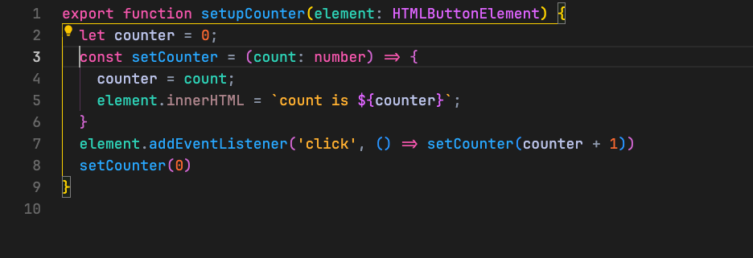

  

### Lunar Eclipse Light

### Lunar Eclipse

<!-- test -->

### Total Lunar Eclipse (Lunar Eclipse Dark)

### Lunar Eclipse Golden Hour

Heavily inspired by Gruvbox

### Lunar Eclipse Shadow

A minimal UI inspired by the the default Dark Modern theme

## Extension support:
All themes support the following extensions:
- Gitlens
- GitGraph
- [Todo Tree](/docs/extension-support.md#todo-tree)
