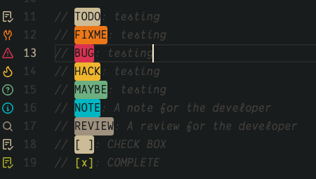

# Todo Tree

## Lunar Eclipse


## Lunar Eclipse Light


## Total Lunar Eclipse


## Golden Hour


#### Add to your settings.json:
```json
{
      // Todo Tree
    "todo-tree.general.tags": [
        "TODO",
        "BUG",
        "FIXME",
        "ISSUE",
        "HACK",
        "MAYBE",
        "NOTE",
        "REVIEW",
        "[ ]",
        "[x]"
    ],
    "todo-tree.highlights.customHighlight": {
        "TODO": {
            "foreground": "#191C1D",
            "background": "#CCBB97",
            "icon": "checklist",
            "iconColour": "#CCBB97",
            "gutterIcon": true
        },
        "FIXME": {
            "foreground": "#191C1D",
            "background": "#ED7717",
            "icon": "tools",
            "iconColour": "#ED7717",
            "gutterIcon": true
        },
        "BUG": {
            "foreground": "#191C1D",
            "background": "#D93251",
            "icon": "alert",
            "iconColour": "#D93251",
            "gutterIcon": true
        },
        "HACK": {
            "foreground": "#191C1D",
            "background": "#EFB52D",
            "icon": "flame",
            "iconColour": "#EFB52D",
            "gutterIcon": true
        },
        "MAYBE": {
            "foreground": "#191C1D",
            "background": "#6DAF81",
            "icon": "question",
            "iconColour": "#6DAF81",
            "gutterIcon": true
        },
        "NOTE": {
            "foreground": "#191C1D",
            "background": "#00B6C2",
            "icon": "info",
            "iconColour": "#00B6C2",
            "gutterIcon": true
        },
        "REVIEW": {
            "foreground": "#191C1D",
            "background": "#9F917D",
            "icon": "search",
            "iconColour": "#9F917D",
            "gutterIcon": true
        },
        "[ ]": {
            "foreground": "#191C1D",
            "background": "#CCBB97",
            "icon": "checklist",
            "iconColour": "#CCBB97",
            "gutterIcon": true
        },
        "[x]": {
            "foreground": "#AEB124",
            "background": "#191C1D",
            "icon": "checklist",
            "iconColour": "#AEB124",
            "gutterIcon": true
        }
    },
}

```
